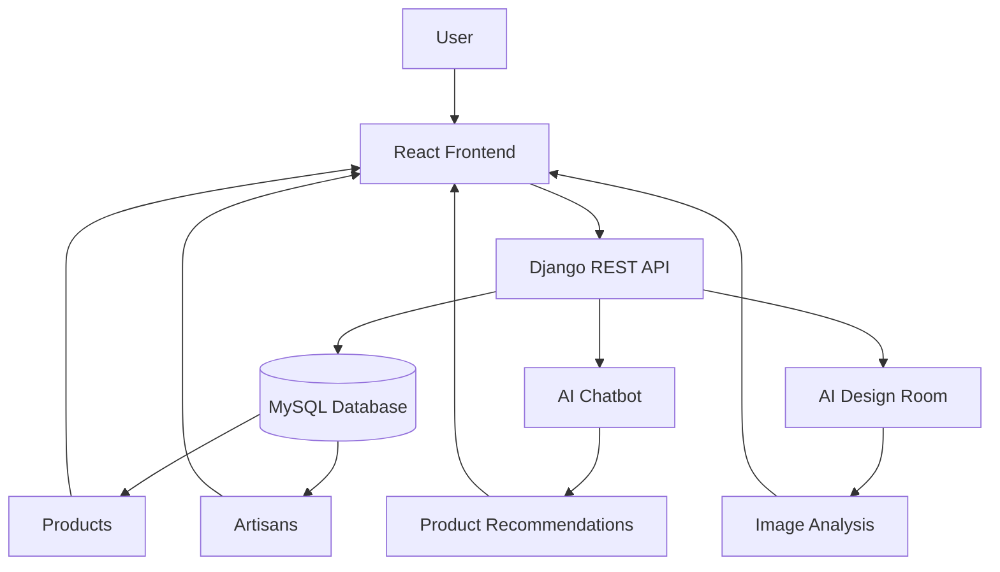

# 🎨 Craftelligence

<p align="center">


</p>

**Craftelligence** is an **AI-powered multilingual handicraft e-commerce platform** that connects customers with skilled artisans while providing an intelligent and personalized shopping experience.

The platform combines **React**, **Django**, and **Artificial Intelligence** to help users discover handcrafted products, interact with an AI chatbot, and visualize handicrafts in their own space using AI-powered image analysis.

---

# ✨ Features

### 🌍 Multilingual Support

* Supports multiple languages
* Easy language switching
* Improved accessibility for diverse users

### 🛍️ Handicraft Marketplace

* Browse handcrafted products
* Search & filter by category
* Product details page
* User-friendly shopping experience

### 🤖 AI Chatbot

* Intelligent product recommendations
* Artisan discovery
* Customer support
* Natural language conversations

### 🎨 AI Design Room

* Upload a room or wall image
* AI analyzes the uploaded image
* Recommends matching handicraft products
* Helps visualize products before purchasing

### 👨‍🎨 Artisan Discovery

* Browse artisan profiles
* Explore handcrafted collections
* Discover products based on artisan specialties

### 🔐 Secure Authentication

* User Registration
* Login & Logout
* Role-based authentication
* Secure backend APIs

---

# 🏗️ System Architecture



---

# ⚙️ Tech Stack

| Category | Technologies                          |
| -------- | ------------------------------------- |
| Frontend | React.js, HTML5, CSS3, JavaScript     |
| Backend  | Django, Django REST Framework         |
| Database | MySQL                                 |
| AI       | Gemini API, Hugging Face, OpenRouter  |
| Features | AI Chatbot, Image Recommendation, NLP |
| Tools    | Git, GitHub                           |

---

# 📂 Project Structure

```text
Craftelligence/

├── frontend/
├── backend/
├── media/
├── static/
├── requirements.txt
└── README.md
```

---

# 🚀 Installation

## Clone the Repository

```bash
git clone https://github.com/your-username/Craftelligence.git
```

```bash
cd Craftelligence
```

---

## Backend Setup

```bash
cd backend
```

Create a virtual environment

```bash
python -m venv venv
```

Activate it

**Windows**

```bash
venv\Scripts\activate
```

**Linux / macOS**

```bash
source venv/bin/activate
```

Install dependencies

```bash
pip install -r requirements.txt
```

Run the backend

```bash
python manage.py migrate
```

```bash
python manage.py runserver
```

---

## Frontend Setup

```bash
cd frontend
```

```bash
npm install
```

```bash
npm start
```

---

# 🔑 Environment Variables

Store your API keys securely using environment variables instead of hardcoding them.

Create a `.env` file (or configure your Django settings to read from environment variables):

```env
GEMINI_API_KEY=your_gemini_api_key

HUGGINGFACE_API_KEY=your_huggingface_api_key

OPENROUTER_API_KEY=your_openrouter_api_key

SECRET_KEY=your_django_secret_key

STRIPE_SECRET_KEY=your_stripe_secret_key

STRIPE_PUBLISHABLE_KEY=your_stripe_publishable_key
```

> **Note:** Never commit your `.env` file or real API keys to GitHub.

---

# 📸 Screenshots

Add screenshots of:

* 🏠 Home Page
* 🛍️ Product Listing
* 🤖 AI Chatbot
* 🎨 AI Design Room
* 👨‍🎨 Artisan Profile
* 📦 Product Details
* 🌍 Multilingual Interface

---

# 🚀 Future Enhancements

* 💳 Stripe Payment Integration
* 📦 Order Tracking
* ❤️ Wishlist
* ⭐ Product Reviews & Ratings
* 🎤 Voice-enabled AI Assistant
* 🎯 Personalized AI Recommendations
* 📱 Mobile Application
* 📊 Admin Analytics Dashboard

---

# 👨‍💻 Contributors

**Jenil Mangukiya**

---

# 📄 License

This project was developed for **educational and academic purposes**.

---

## ⭐ Support

If you found this project useful, consider giving it a **⭐ Star** on GitHub.

Your support helps others discover the project and encourages future development.
